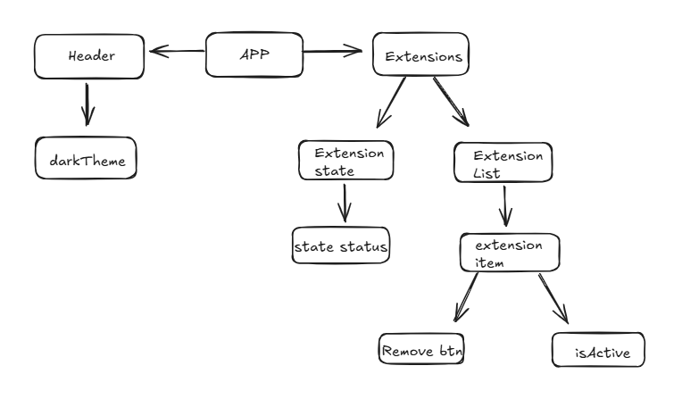

# 🕹️ UI_Gerenciador_Extensões


## 🛒 Sobre o Projeto

Projeto idealizado a partir do desafio de gerenciador de extensões browser do site FrontendMentor , no qual exige a elaboração de uma UI responsiva para lidar com a listagem de multiplos componentes de extensões e seus respectivos estados de ativação. O gerenciador filtra a seleção das extensões a partir do estado de ativação, selecionado pelo próprio usuário no componente da extensão.


## ✨ Funcionalidades

-   ✅ **Filtragem de conteúdos em exibição** Filtre os componentes de extensão que serão exibidos por estado de ativação.

-   ✅ **Seleção de temas Dark/Light** O usuário pode alternar entre os temas claro e escuro na aplicação.

---

## 🎯 Objetivo do Projeto

O objetivo principal do projeto foi reforçar alguns conceitos de UI , manipulação do estado global no react e tratamento de dados externos via JSON.

Utilizei o zustand como ferramenta para lidar com gerenciamento de estados globais , anteriormente utilizava o contextAPI , porém por ser mais verboso quanto ao código escrito, utilizei o zustand para simplificar a verbosidade e facilitar a escalabilidade da aplicação. O zustand facilitou a elevação do estado, lifting state up, do componente lista , para implementar funcionalidade de filtragem, que estava em um componente mas externo, a mesma tratativa para gerar a alteração entre temas claro e escuro.

Como forma de lidar com componentes dinâmicos e multiplas manipulações da UI pelo usuário, utilizei o react com o vite para apropriar os benefícios da renderização no cliente. O next seria como "Matar umar formiga com uma bazuca", seu paradigma de roteamento por arquivos não se faz necessário para essa aplicação, pois não possui roteamento e o uso do SEO também não é requisitado exclusivamente.

O tailwind vem com a premissa de facilitar a elaboração de componentes reutilizáveis e tornar mais rápido o desenvolviemto do codigo. Ademais, com classes css prontas, a implementação da funcionalidade claro e escuro fica mais simples.


---

## 🚀 Tecnologias Utilizadas

<p align="left">
  <a href="https://react.dev/" target="_blank" rel="noreferrer"> 
    
  </a>
  <a href="https://www.typescriptlang.org/" target="_blank" rel="noreferrer"> 
    
  </a>
  <a href="https://github.com/pmndrs/zustand" target="_blank" rel="noreferrer"> 
    
  </a>
  <a href="https://tailwindcss.com/" target="_blank" rel="noreferrer"> 
    
  </a>
  <a href="https://vitejs.dev/" target="_blank" rel="noreferrer"> 
    
  </a>
  <a href="https://vercel.com/" target="_blank" rel="noreferrer">
    
  </a>
</p>

---

## 🏗️ Estrutura de Componentes

A imagem abaixo ilustra a arquitetura de componentes do projeto, mostrando o fluxo de dados (props) e o relacionamento entre eles.



---


## 🔧 Instruções de Instalação

Para rodar este projeto localmente, siga os passos abaixo:


1.  Abra a IDE ou editor de código a sua escolha
   

2.  Abra o terminal (CMD, PowerShell, ou o terminal integrado da sua IDE) e clone o repositório:
    ```bash
    git clone https://github.com/Lucasmenezes08/UI_gerenciador_extensoes
    ```

3.  digite o comando para abrir a pasta do projeto:
    ```bash
    cd UI_gerenciador_extensoes
    ```

4.  novamente digite o comando para abrir a pasta do projeto:
    ```bash
    cd ui_gerenciador_extensoes
    ```


5.  Instale todas as dependências necessárias:
    ```bash
    npm install
    ```

6.  Inicie o servidor de desenvolvimento:
    ```bash
    npm run dev
    ```

Após executar esses comandos, o projeto estará disponível em `http://localhost:5173